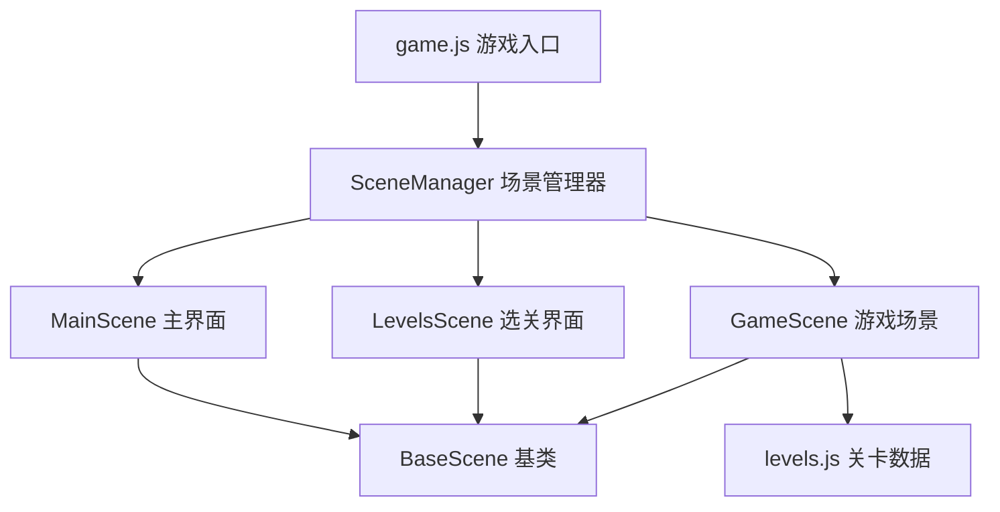
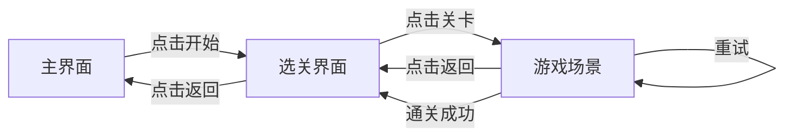
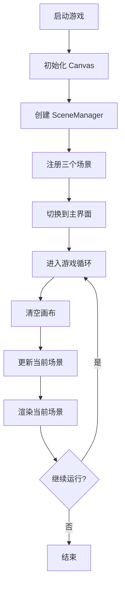
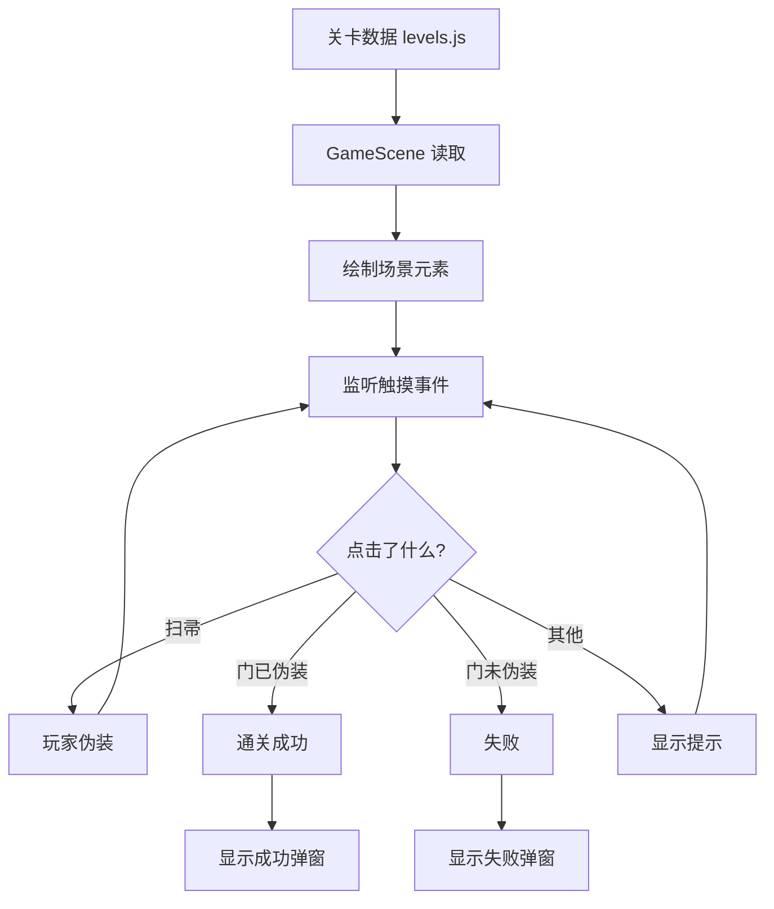

# 项目架构图

## 整体架构



## 场景流转



## 游戏主循环



## 关卡系统



## 文件依赖关系

```
game.js
├── SceneManager.js
│   ├── MainScene.js
│   │   └── BaseScene.js
│   ├── LevelsScene.js
│   │   ├── BaseScene.js
│   │   └── levels.js
│   └── GameScene.js
│       ├── BaseScene.js
│       └── levels.js
```

## 类结构

```
BaseScene (基类)
├── 属性
│   ├── canvas
│   ├── ctx
│   ├── config
│   └── sceneManager
├── 方法
│   ├── init()
│   ├── update()
│   ├── render()
│   ├── destroy()
│   ├── drawText()
│   ├── drawButton()
│   ├── drawCircleButton()
│   ├── drawStickman()
│   ├── isPointInRect()
│   └── isPointInCircle()

MainScene extends BaseScene
├── 属性
│   └── startButton
└── 方法
    ├── init()
    ├── render()
    └── onTouchEnd()

LevelsScene extends BaseScene
├── 属性
│   ├── levels
│   ├── backButton
│   ├── helpButton
│   └── levelButtons
└── 方法
    ├── init()
    ├── render()
    ├── drawTopBar()
    ├── drawLevelGrid()
    └── onTouchEnd()

GameScene extends BaseScene
├── 属性
│   ├── levelId
│   ├── levelData
│   ├── gameState
│   ├── clickedItems
│   ├── playerDisguised
│   └── elements
└── 方法
    ├── init()
    ├── render()
    ├── drawTopInfo()
    ├── drawSceneElements()
    ├── drawCharacter()
    ├── drawObject()
    ├── drawItem()
    ├── drawGameResult()
    ├── handleElementClick()
    ├── onElementClick()
    └── handleLevel31Click()
```

## 数据流

```
用户点击
    ↓
wx.onTouchEnd
    ↓
Scene.onTouchEnd()
    ↓
碰撞检测
    ↓
业务逻辑处理
    ↓
更新游戏状态
    ↓
下一帧渲染
```

## Canvas 绘制层次

```
Canvas 画布
├── 背景色 (fillRect)
├── 场景元素层
│   ├── 公司大门 (矩形 + 门把手)
│   ├── 角色 (简笔画)
│   └── 道具 (扫帚、箱子)
├── UI层
│   ├── 顶部信息栏
│   ├── 剧情文字框
│   └── 按钮
└── 弹窗层 (成功/失败)
    ├── 半透明遮罩
    ├── 弹窗背景
    ├── 提示文字
    └── 重试按钮
```

---

**说明**：以上架构图展示了整个游戏的核心结构和数据流向
